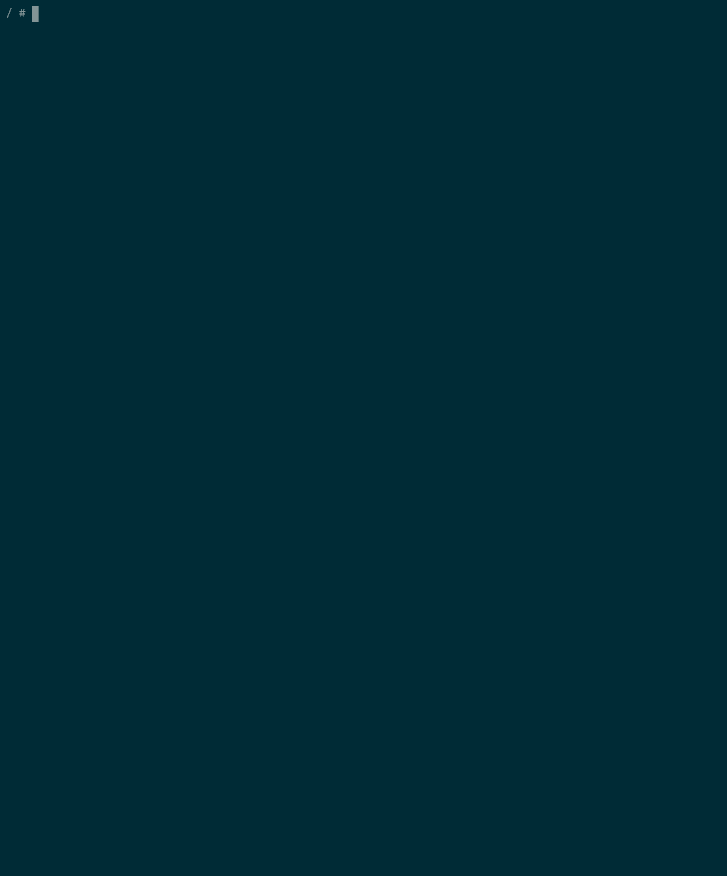

# Tensorflow Lite Python Runtime for Raspberry Pi Zero

Project to generate the necessary environment to compile the tensorflow library for Python.

<div align="center">
	
</div>

## Usage

```
build_image.sh
```

Create the docker image that simulates a raspberry pi zero and that will be used to build the tensorflow module for python.

Once the image is created, we start the container:

```
docker run -it tflite_runtime_rpi0:latest
```

Already inside the container, we start the qemu VM that emulates a raspberry pi zero:

> **The default login is the same as Raspberry:**
> - **User**: pi
> - **Password**: raspberry

```
/bootvm.sh
```

### Compiling

Clone this repository inside the VM

```
git clone https://github.com/jhuss/tflite_runtime_rpi0.git
```

Install dependencies

```
sudo tflite_builder/install_packages.sh
```

Compile the python module

```
tflite_builder/build_package.sh
```

Once finished, the module is in `tflite_builder/build/dist/` and can be copied outside the VM via ssh.

### Installing

```
pip install tflite_runtime-2.9.0-cp39-cp39-linux_armv6l.whl
```

It can be installed on the **venv** or on the system with **sudo**.

Enjoy.

## Caveat

- Sometimes the qemu VM freezes or kernel panics, you just need to restart the docker container and reconnect

  ```
  docker restart <CONTAINER_ID_OF_TFLITE_RUNTIME_RPI0>
  ```

  then

  ```
  docker attach <CONTAINER_ID_OF_TFLITE_RUNTIME_RPI0>
  ```

  And boot VM again with `/bootvm.sh`

## Thanks

Thanks to @lukechilds for his lukechilds/dockerpi repo.

## License

MIT © Jesus Jerez
